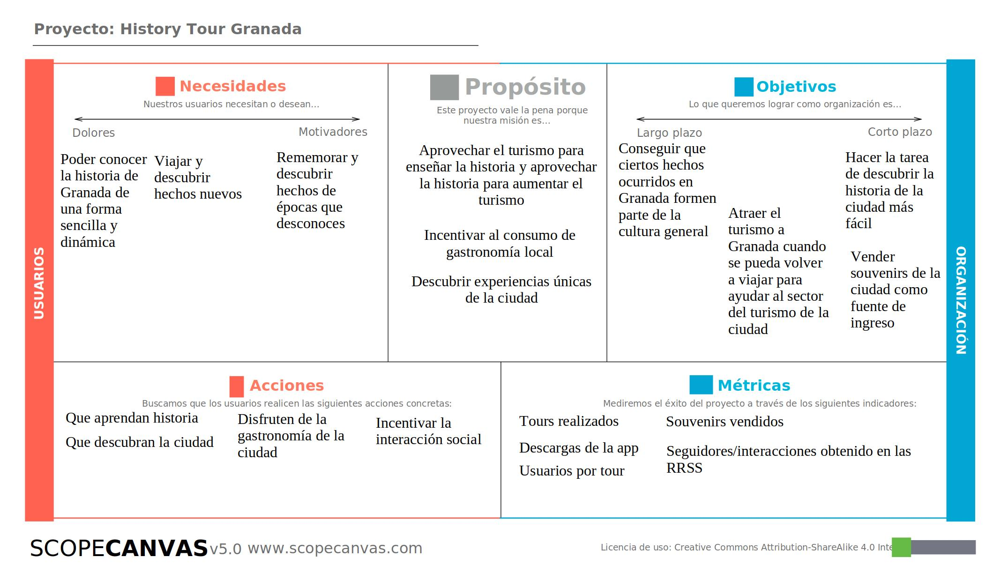
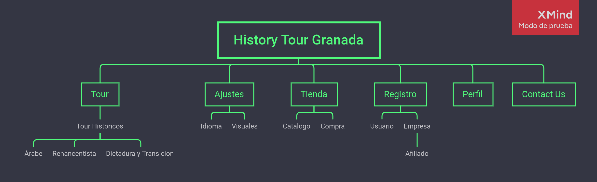
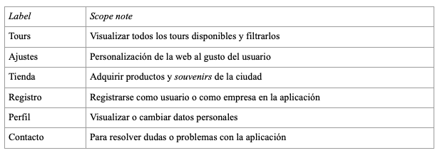
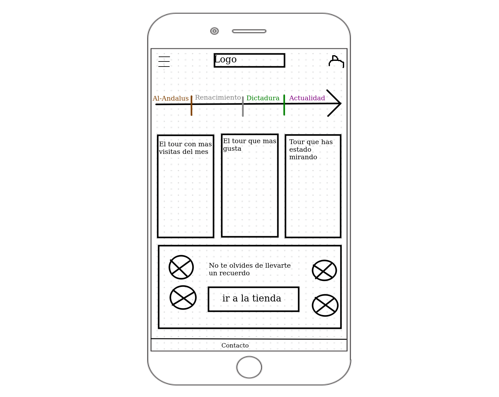
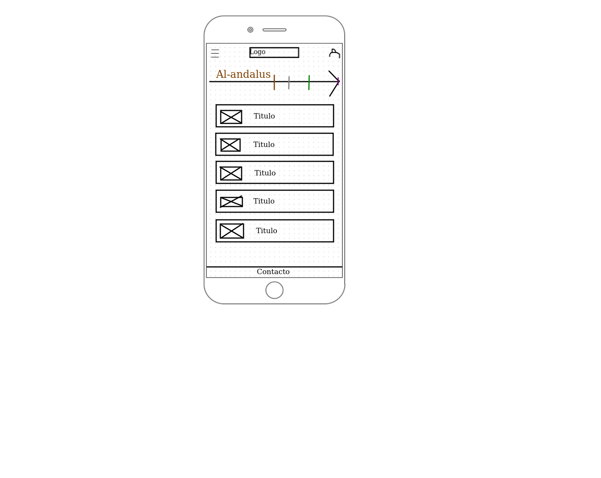
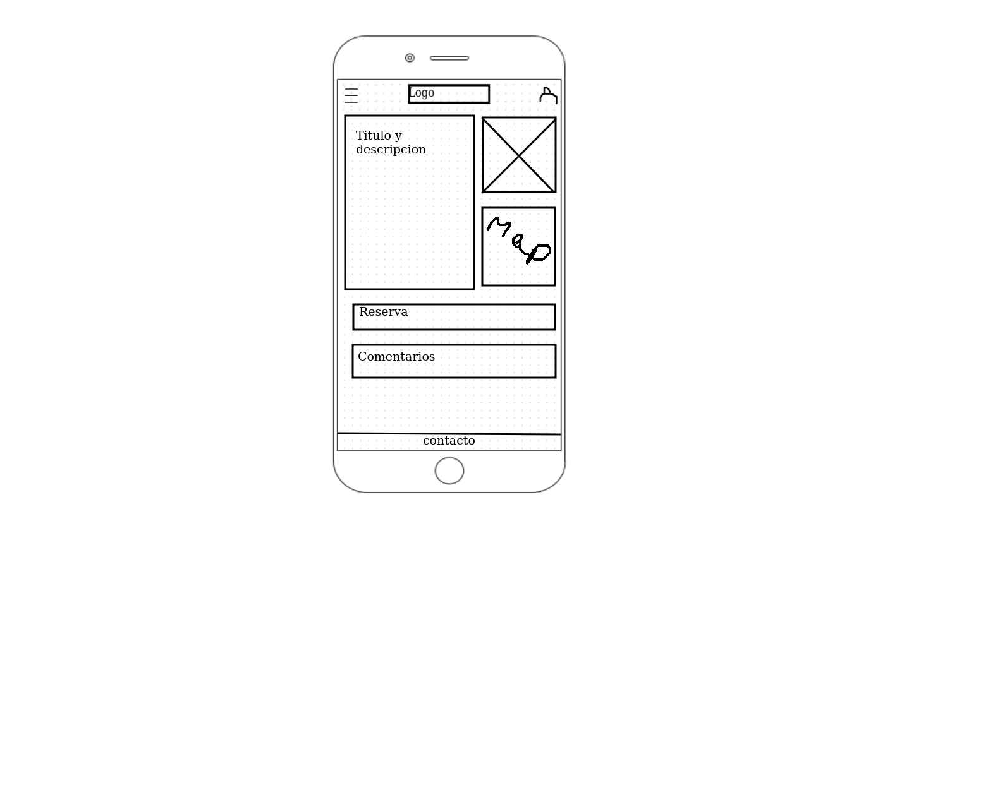
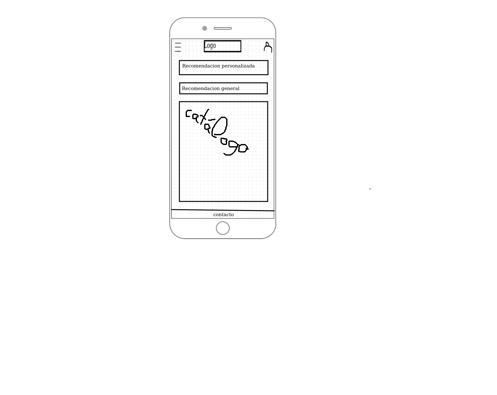

## DIU - Practica2, entregables

### Ideación 
* Malla receptora de información 

### PROPUESTA DE VALOR
* Nuestra propuesta: Nuestra aplicación consiste en una guía para turistas de la ciudad de Granada, orientada a conocer las distintas etapas de su pasado. Contará con recorridos temáticos por los sitios más emblemáticos de cada uno de los periodos de la ciudad, enclaves de gran interés turístico y ofertas de restauración orientadas, de igual manera, a experimentar cada época de la ciudad nazarí. 
* ScopeCanvas 
* 

### TASK ANALYSIS
* User Task Matrix 
* 

### ARQUITECTURA DE INFORMACIÓN

* Sitemap 
* 
* Labelling 
* 

### Prototipo Lo-FI Wireframe 
* Prototipo de la portada de la página 
* 
* Prototipo del perfil de usuario 
* 
* Prototipo de filtrar los tour con la linea temporal 
* 
* Prototipo de vista del tour 
* 
* Prototipo de la tienda de Souvenir 
* 

### Conclusiones  
*Hemos aprendido que el uso de un buen prototipo despues de la idea inicial y antes de la implementación es muy necesario, ya que a la hora de realizar el trabajo será más sencillo. Además el "task analysis" y planificar la arquitectura de información simplifica bastante la creación de estos prototipos.
