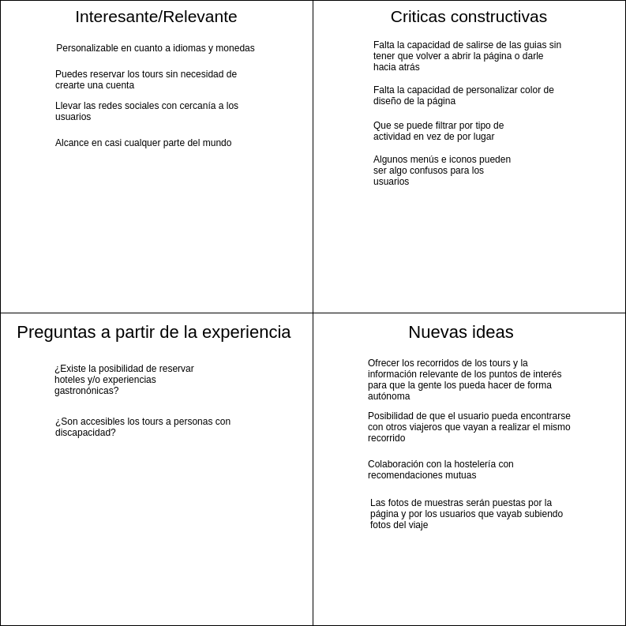

## DIU - Practica2, entregables

### Ideación 
* Malla receptora de información 

### PROPUESTA DE VALOR
* Nuestra propuesta: Nuestra aplicación consiste en una guía para turistas de la ciudad de Granada, orientada a conocer las distintas etapas de su pasado. Contará con recorridos temáticos por los sitios más emblemáticos de cada uno de los periodos de la ciudad, enclaves de gran interés turístico y ofertas de restauración orientadas, de igual manera, a experimentar cada época de la ciudad nazarí. 
* ScopeCanvas 

### TASK ANALYSIS
* User Task Matrix 

### ARQUITECTURA DE INFORMACIÓN

* Sitemap 
* Labelling 

### Prototipo Lo-FI Wireframe 

### Conclusiones  
(incluye valoración de esta etapa)
