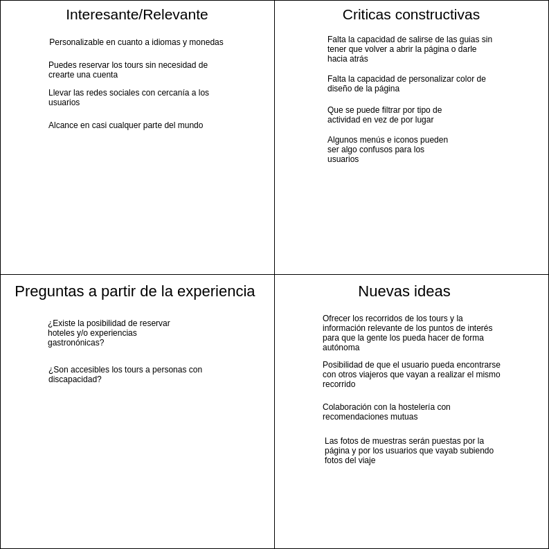
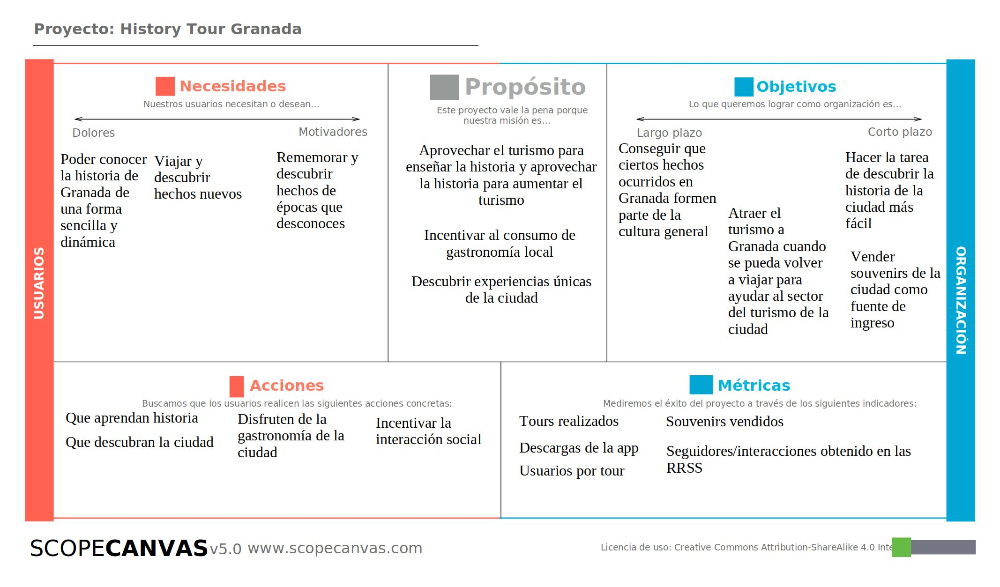
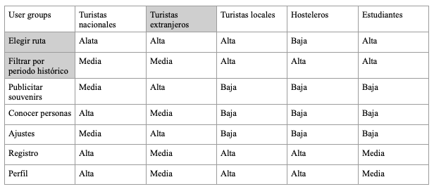
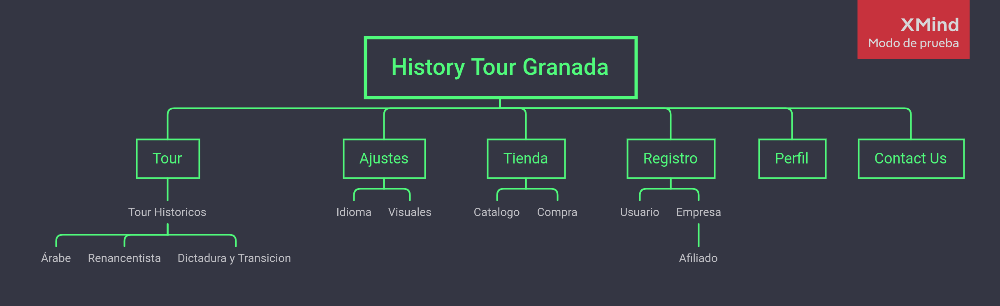
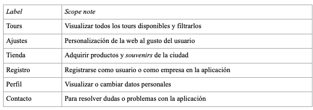
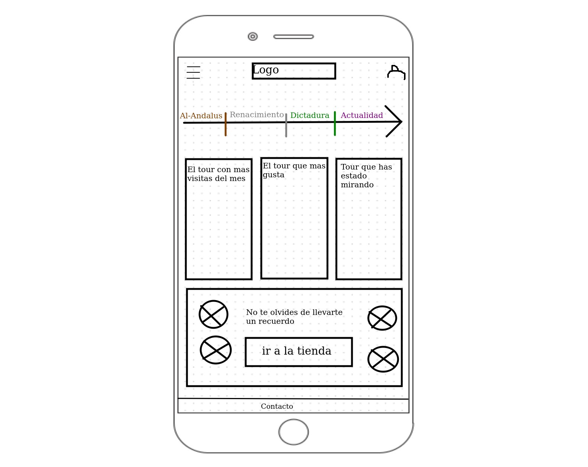
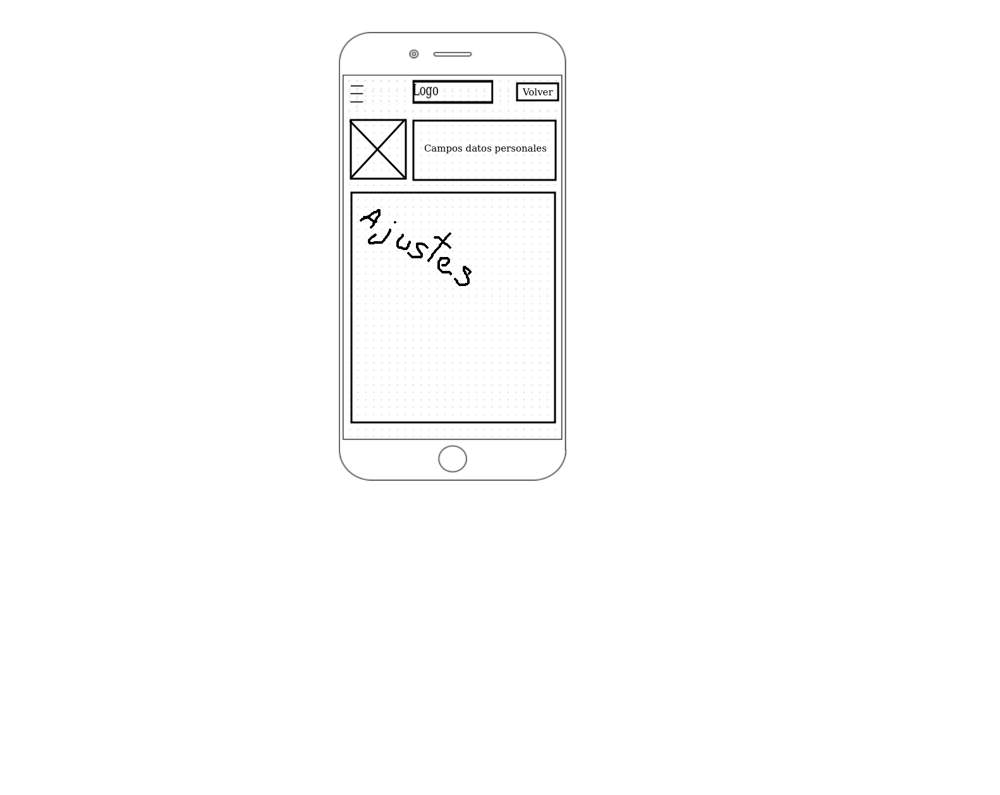
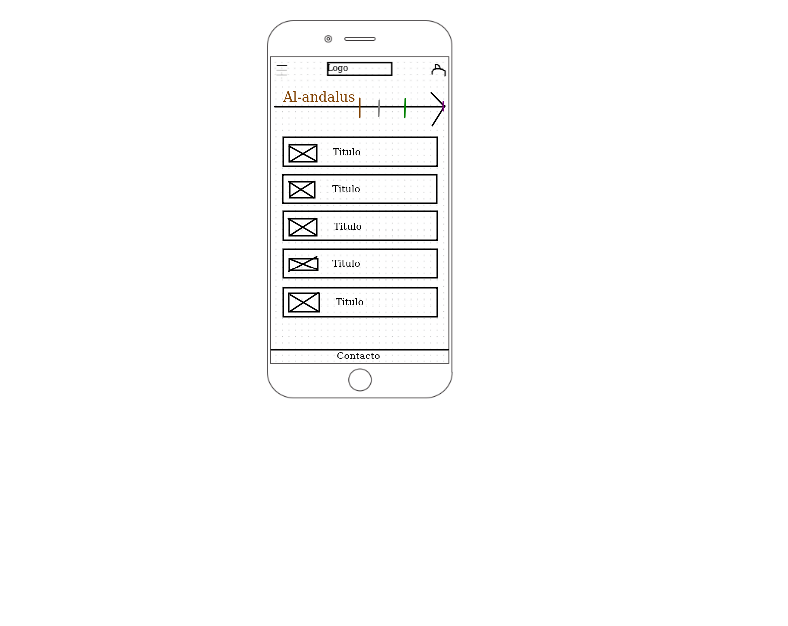
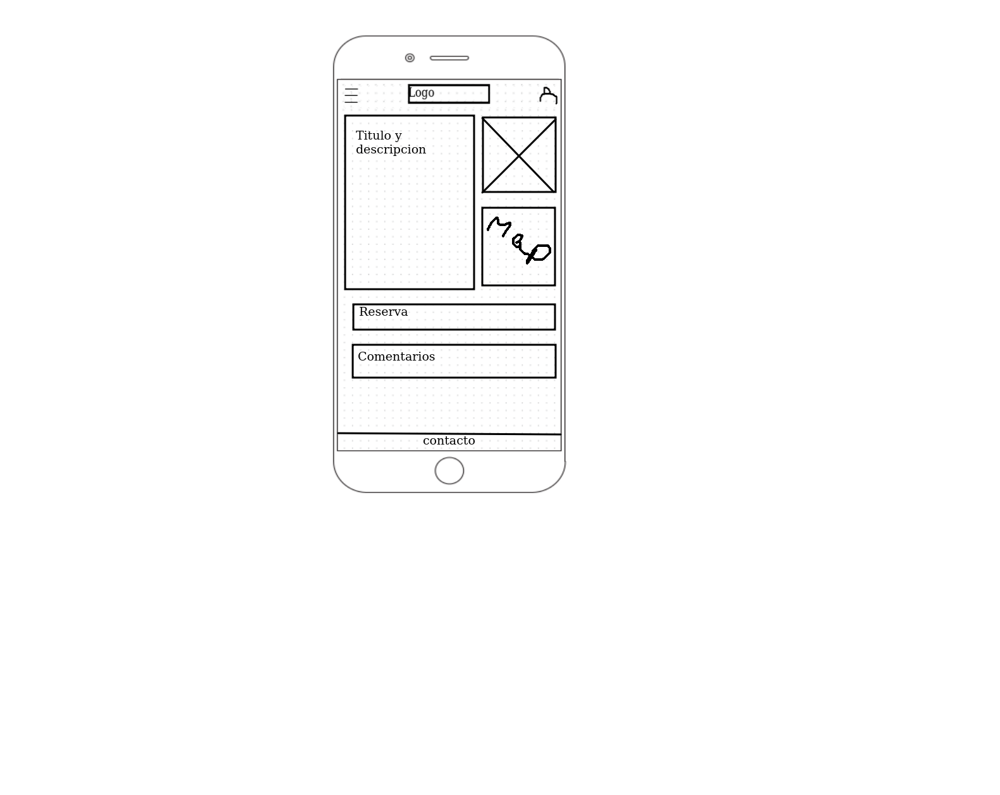
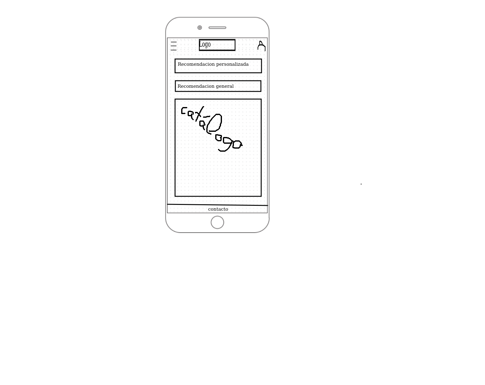

# DIU21
Prácticas Diseño Interfaces de Usuario 2020-21 (Tema: Turismo) 

Grupo: DIU3.inac1  Curso: 2020/21 
Updated: 17/3/2021

Proyecto: 
>>> History Tour Granada

Descripción: 

Nuestra aplicación consiste en una guía para turistas de la ciudad de Granada, orientada a conocer las distintas etapas de su pasado. Contará con recorridos temáticos por los sitios más emblemáticos de cada uno de los periodos de la ciudad, enclaves de gran interés turístico y ofertas de restauración orientadas, de igual manera, a experimentar cada época de la ciudad nazarí. 

Logotipo: 
>>> Opcionalmente si diseña un logotipo para su producto en la práctica 3 pongalo aqui

Miembros
 * :bust_in_silhouette: Hamed Ignacio Benaisa Cruz @Nacho-beta   :octocat:     
 * :bust_in_silhouette: Jose Miguel Feixas Galdeano @miguefeixas :octocat:

----- 
# Proceso de Diseño 

## Paso 1. UX Desk Research & Analisis 

 1.a Competitive Analysis
-----
>>> Tras comparar diferentes webs orientadas a la reserva de free tours y otras experiencias turísticas hemos podido observar que, entre las opciones elegidas, Civitatis era la que mejor cumplía los puntos que evaluamos y por tanto ha sido la elegida para la realización de la práctica.

 1.b Persona
-----
>>> Se han propuesto 2 personas muy distintas entre ellas. Uno tiene objetivos asequibles pero apenas es permisivo y la otra es el caso contrario.
>>> William: 
>>> Nora: 

 1.c User Journey Map
----
>>> Hemos escogido estas experiencias porque pensamos que incluyen tanto a la gente muy ambiciosa y poco permisiva como a sus contrarios y que estos son los dos posibles extremos. 
>>> Experiencia de William:
>>> Experiencia de Nora: 

 1.d Usability Review
----
>>> - Enlace al documento: [documento pdf](https://github.com/Nacho-beta/DIU21/blob/master/P1/Usability-review.pdf)
>>> - Valoración final (numérica): 84
>>> - Comentario sobre la valoración: Civitatis es una web que cumple con creces, intuitiva, efectiva, sin ningún error apreciable y orientada a un gran número de usuarios debido a sus posibilidad de personalización.

## Paso 2. UX Design  

 2.a Feedback Capture Grid
----

>>> Feedback Capture Grid:
>>>   
    
>>> ¿Que planteas como "propuesta de valor" para un nuevo diseño de aplicación para economia colaborativa ?
>>>Propuesta: Nuestra aplicación consiste en una guía para turistas de la ciudad de Granada, orientada a conocer las distintas etapas de su pasado. Contará con recorridos temáticos por los sitios más emblemáticos de cada uno de los periodos de la ciudad, enclaves de gran interés turístico y ofertas de restauración orientadas, de igual manera, a experimentar cada época de la ciudad nazarí. 

 2.b ScopeCanvas
----
>>> ScopeCanvas:
>>>   

 2.b Tasks analysis 
-----

>>> User Task Matrix:
>>> 

 2.c IA: Sitemap + Labelling 
----

>>> Sitemap: 
>>> Labelling: 

 2.d Wireframes
-----

>>> Prototipos:
>>> ### Prototipo Lo-FI Wireframe 
* Prototipo de la portada de la página 
* 
* Prototipo del perfil de usuario 
* 
* Prototipo de filtrar los tour con la linea temporal 
* 
* Prototipo de vista del tour 
* 
* Prototipo de la tienda de Souvenir 
* 

## Paso 3. Mi UX-Case Study (diseño)

 3.a Moodboard
-----

>>> Plantear Diseño visual con una guía de estilos visual (moodboard) 
>>> Incluir Logotipo
>>> Si diseña un logotipo, explique la herramienta utilizada y la resolución empleada. ¿Puede usar esta imagen como cabecera de Twitter, por ejemplo, o necesita otra?

  3.b Landing Page
----

>>> Plantear Landing Page 

 3.c Guidelines
----

>>> Estudio de Guidelines y Patrones IU a usar 
>>> Tras documentarse, muestre las deciones tomadas sobre Patrones IU a usar para la fase siguiente de prototipado. 

  3.d Mockup
----

>>> Layout: Mockup / prototipo HTML  (que permita simular tareas con estilo de IU seleccionado)

 3.e ¿My UX-Case Study?
-----

>>> Publicar my Case Study en Github..
>>> Documente y resuma el diseño de su producto en forma de video de 90 segundos aprox

## Paso 4. Evaluación 

 4.a Caso asignado
----

>>> Breve descripción del caso asignado con enlace a  su repositorio Github

 4.b User Testing
----

>>> Seleccione 4 personas ficticias. Exprese las ideas de posibles situaciones conflictivas de esa persona en las propuestas evaluadas. Asigne dos a Caso A y 2 al caso B
 

| Usuarios | Sexo/Edad     | Ocupación   |  Exp.TIC    | Personalidad | Plataforma | TestA/B
| ------------- | -------- | ----------- | ----------- | -----------  | ---------- | ----
| User1's name  | H / 18   | Estudiante  | Media       | Introvertido | Web.       | A 
| User2's name  | H / 18   | Estudiante  | Media       | Timido       | Web        | A 
| User3's name  | M / 35   | Abogado     | Baja        | Emocional    | móvil      | B 
| User4's name  | H / 18   | Estudiante  | Media       | Racional     | Web        | B 

. 4.c Cuestionario SUS
----

>>> Usaremos el **Cuestionario SUS** para valorar la satisfacción de cada usuario con el diseño (A/B) realizado. Para ello usamos la [hoja de cálculo](https://github.com/mgea/DIU19/blob/master/Cuestionario%20SUS%20DIU.xlsx) para calcular resultados sigiendo las pautas para usar la escala SUS e interpretar los resultados
http://usabilitygeek.com/how-to-use-the-system-usability-scale-sus-to-evaluate-the-usability-of-your-website/)
Para más información, consultar aquí sobre la [metodología SUS](https://cui.unige.ch/isi/icle-wiki/_media/ipm:test-suschapt.pdf)

>>> Adjuntar captura de imagen con los resultados + Valoración personal 

 4.d Usability Report
----

>> Añadir report de usabilidad para práctica B (la de los compañeros)

>>> Valoración personal 

## Paso 5. Evaluación de Accesibilidad  

  5.a Accesibility evaluation Report 
----

>>> Indica qué pretendes evaluar (de accesibilidad) sobre qué APP y qué resultados has obtenido 

>>> 5.a) Evaluación de la Accesibilidad (con simuladores o verificación de WACG) 
>>> 5.b) Uso de simuladores de accesibilidad 

>>> (uso de tabla de datos, indicar herramientas usadas) 

>>> 5.c Breve resumen del estudio de accesibilidad (de práctica 1) y puntos fuertes y de mejora de los criterios de accesibilidad de tu diseño propuesto en Práctica 4.

## Conclusión final / Valoración de las prácticas

>>> (90-150 palabras) Opinión del proceso de desarrollo de diseño siguiendo metodología UX y valoración (positiva /negativa) de los resultados obtenidos  

