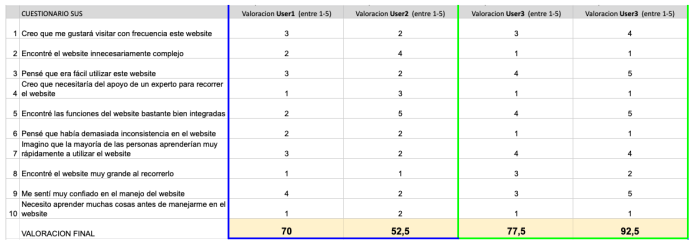

# DIU21
Prácticas Diseño Interfaces de Usuario 2020-21 (Tema: Turismo) 

Grupo: DIU3.inac1  Curso: 2020/21 

Proyecto: 
>>> History Tour Granada

Descripción: 

Nuestra aplicación consiste en una guía para turistas de la ciudad de Granada, orientada a conocer las distintas etapas de su pasado. Contará con recorridos temáticos por los sitios más emblemáticos de cada uno de los periodos de la ciudad, enclaves de gran interés turístico y ofertas de restauración orientadas, de igual manera, a experimentar cada época de la ciudad nazarí. 

Logotipo: 

Miembros
 * :bust_in_silhouette: Hamed Ignacio Benaisa Cruz @Nacho-beta   :octocat:     
 * :bust_in_silhouette: Jose Miguel Feixas Galdeano @miguefeixas :octocat:

----- 
# Proceso de Diseño 

## Paso 1. UX Desk Research & Analisis 
 1.a Competitive Analysis
-----
>>> Tras comparar diferentes webs orientadas a la reserva de free tours y otras experiencias turísticas hemos podido observar que, entre las opciones elegidas, Civitatis era la que mejor cumplía los puntos que evaluamos y por tanto ha sido la elegida para la realización de la práctica.

 1.b Persona
-----
>>> Hemos elegido a [William](./P1/persona1_William.png) un científico con mucha personalidad y a [Nora](./P1/persona2_Nora.png) una madre de familia que quiere complacer a sus hijos.

 1.c User Journey Map
----
>>> Hemos escogido estas experiencias ya que son dos usuarios muy distintos entre sí y creemos que son hechos que le podrían ocurrir. [Mapa de William](P1/journey_map_william.png) y [Mapa de Nora](P1/journey_map_nora.png)

 1.d Usability Review
----
>>> - Enlace al documento: [documento pdf](https://github.com/Nacho-beta/DIU21/blob/master/P1/Usability-review.pdf)
>>> - Valoración final (numérica): 84
>>> - Comentario sobre la valoración: Civitatis es una web que cumple con creces, intuitiva, efectiva, sin ningún error apreciable y orientada a un gran número de usuarios debido a sus posibilidad de personalización. Comparandola con las alternativas a esta es muy superior en practicamente todos los aspectos.

## Paso 2. UX Design  
 2.a Feedback Capture Grid
----
>>> Feedback Capture Grid:
>>> En esta [malla](P2/ideacion_MallaReceptora.png) hemos hecho un ánalisis de los aspectos de Civitatis para incorporarlos a nuestra nueva propuesta junto a los aspectos que creemos que le falta.
    
>>>Propuesta: Nuestra aplicación consiste en una guía para turistas de la ciudad de Granada, orientada a conocer las distintas etapas de su pasado. Contará con recorridos temáticos por los sitios más emblemáticos de cada uno de los periodos de la ciudad, enclaves de gran interés turístico y ofertas de restauración orientadas, de igual manera, a experimentar cada época de la ciudad nazarí. 

 2.b ScopeCanvas
----
>>> En nuestro diseño con [ScopeCanvas](P2/propuestaValor/scope_canvas.jpg) hemos planteado una aplicación basada en Civitatis la cual va a organizar Tour históricos por Granada. En este diagrama describimos los objetivos, necesidas y acciones de esta, además de las métricas con las cual medimos si nuestra aplicación está funcionando. 

 2.b Tasks analysis 
-----
>>> En nuestra [User Task Matrix](P2/userTaskMatrix.png) definimos los 5 grupos de usuarios usuarios los cuales son los objetivo de nuestra aplicacion History Tour, y las 7 tareas a realizar. Marcamos en gris los usuarios que son nuestro objetivo principal y las tareas indispensables de la app. 

 2.c IA: Sitemap + Labelling 
----
A travñes de nuestro [Sitemap](P2/arquitecturaInformacion/HistoryTourGranada.png) indicamos la jerarquía de nuestra web y a través de cual app podemos acceder. Y con nuestro [labelling](P2/arquitecturaInformacion/labelling.png) indicamos la jerarquía de las funcionalidades de nuestra aplicación.

 2.d Wireframes
-----
>>> Prototipos:
>>> ### Prototipo Lo-FI Wireframe 
* [Prototipo de la portada de la página](P2/prototipo/prototipoPortada.png)
* [Prototipo del perfil de usuario](P2/prototipo/prototipoPerfil.png)
* [Prototipo de filtrar los tour con la linea temporal](P2/prototipo/prototipoToursFiltrados.png)
* [Prototipo de vista del tour](P2/prototipo/prototipoTourEsp.png)
* [Prototipo de la tienda de Souvenir](P2/prototipo/prototipoTienda.png)

## Paso 3. Mi UX-Case Study (diseño)
 3.a Moodboard
-----
Hemos recogido los elementos de distintos patrones y guidlines que hemos reconocido útiles para nuestra aplicación. Estos se pueden ver en nuestro [Moodboard](P3/Moodboard/Moodboard.png), donde hemos establecido elementos de diseño y los hemos posicionado respecto a los prototipos.

  3.b Landing Page
----
Hemos realizado una [landing page](https://nacho-beta.github.io/landingPage/) desde la cual se podría descargar nuestra app. Hemos optado por un diseño clásico y elegante para que el usuario no pierda mucho tiempo en esta y realice la descarga de forma casi inmediata.

 3.c Guidelines
----
En este [fichero](P3/Moodboard/Guidelines.pdf) marcamos los distintos elementos guidelines (como botones de texto, botones con imágenes, boton de hamburguesa, etc.). Para los patrones hemos usado un table filtrer para filtrer en diseño de linea temporal para filtrar los distintos tours, y el patrón pagination para mostrar todas los tours y productos de la tienda.

  3.d Mockup
----
Para ver como funciona el diseño Hi-Fi de nuestra aplicación se puede hacer usando la herramienta Adobe XD sobre este [fichero](P3/Mockup/DIU-p3.xd) o leer como funciona y los distintos diseños en este [fichero pdf explicativo](P3/Mockup/DIU-p3.pdf)

 3.e ¿My UX-Case Study?
-----
En este [video](https://drive.google.com/file/d/11oVBmrdf2gstIixLzFrQh4vp3017LEs3/view?usp=sharing) podemos ver un análisis del proceso para obtener nuestra app de History Tour Granada. Solo es accesible a través de una cuenta de la UGR.

## Paso 4. Evaluación 

 4.a Caso asignado
----
Lolis es una aplicación que nos ofrece la posibilidad de organizar un viaje desde cero
cubriendo todas las necesidades que pueden surgir, como la elección de sitio, los recorridos
que se van a realizar en el lugar, los costes del viaje, las reservas o la situación de la
pandemia en el lugar elegido.
Enlace: [github de diu1.aguacate](https://github.com/Olasergiolas/DIU21)

 4.b User Testing
----
| Usuarios | Sexo/Edad| Ocupación               |  Exp.TIC    | Personalidad | Plataforma | TestA/B
| ---------| -------- | ----------------------- | ----------- | -----------  | ---------- | ----
| Maria    | M / 27   | Fotografa               | Alta        | Feliz        | IOS        | A 
| Carlos   | H / 75   | Jubilado                | Baja        | Asustado     | Android    | A 
| Victor   | H / 39   | Militar                 | Media       | Ilusionado   | Android    | B 
| Ana      | M / 21   | Asistenta de compositor | Alta        | Estresada    | Android    | B 

. 4.c Cuestionario SUS
----
>>> Imagen del test SUS

>>> Valoracion personal
Como podemos comprobar, los resultados obtenidos por la aplicación Lolis, son
sustancialmente más altos a los de la aplicación A, Turismo Nazarí. Esto es algo con lo que
nos encontramos muy de acuerdo tras revisar sendas aplicaciones, sin duda alguna podemos
apreciar un trabajo mucho más cuidado en la aplicación objeto de este estudio que en la
usada como comparación en el test A/B.

 4.d Usability Report
----
>> Añadir report de usabilidad para práctica B (la de los compañeros)
Dejamos aquí el pdf con el Usability Report: [Usability Report](./P4/Usability_report.pdf)

>>> Valoración personal 
Estamos delante de una aplicación sobresaliente, en la que se aprecia un trabajo metódico,
consistente y que ha cuidado los detalles desde el principio. El diseño en general y los
colores elegidos son muy agradables y hace que la experiencia de uso sea muy satisfactoria.
A este hecho ayuda que el aprendizaje y uso de la aplicación es realmente sencillo, lo cual
no quita que tenga un gran número de funcionalidades, las cuales creemos que están
elegidas con mucho sentido y que se ajustan a las necesidades de cualquier persona que esté
planeando un viaje.

## Paso 5. Evaluación de Accesibilidad  

  5.a Accesibility evaluation Report 
----

>>> Indica qué pretendes evaluar (de accesibilidad) sobre qué APP y qué resultados has obtenido 

>>> 5.a) Evaluación de la Accesibilidad (con simuladores o verificación de WACG) 
>>> 5.b) Uso de simuladores de accesibilidad 

>>> (uso de tabla de datos, indicar herramientas usadas) 

>>> 5.c Breve resumen del estudio de accesibilidad (de práctica 1) y puntos fuertes y de mejora de los criterios de accesibilidad de tu diseño propuesto en Práctica 4.

## Conclusión final / Valoración de las prácticas

>>> (90-150 palabras) Opinión del proceso de desarrollo de diseño siguiendo metodología UX y valoración (positiva /negativa) de los resultados obtenidos  

